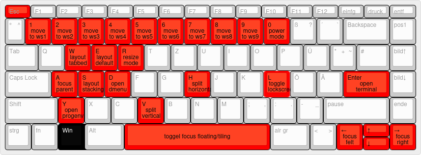

# My current i3 config
This is mainly a backup for when I want to reinstall Linux or when I want to use it on another device.
The mod key is the Windows key, as shown below, but I will refer to it as the mod key.

## Keyboardlayout for all mod+key bindsyms.

The missing bindsyms are:
- mod+esc : power mode
- mod+Up  : focus up
- mod+Down: focus down

## Keyboardlayout for all mod+Shift+key bindsyms.

The missing bindsyms are:
- mod+Shift+Up  : move up
- mod+Shift+Down: move down

## Other

- mod+Control+Right: next workspace
- mod+Control+Left : prev workspace
- resize mode
- power mode

# Overview of all bindsym in this i3 config

## i3 config shortcuts
| Key Combination   | Command             | Description                   |
|------------------|----------------------|-------------------------------|
| $mod+Shift+r     | restart              | Restart i3                    |
| $mod+Shift+e     | exec "i3-nagbar ..." | Exit i3 (with confirmation)   |

## Application shortcuts
| Key Combination | Command                             | Description           |
|-----------------|-------------------------------------|-----------------------|
| $mod+d          | exec --no-startup-id dmenu_run      | Open program launcher |
| $mod+Return     | exec i3-sensible-terminal           | Open terminal         |
| $mod+y          | exec [...]open_work_environment.py  | Open programs for programming         |

## Set fn keys
| Key | Actual called key    | Command                                   | Description                       |
|-----|----------------------|-------------------------------------------|-----------------------------------|
| F1  | $mod+F1              | ... open https://github.com/StefansCode/i3| opens README for this i3config    |
| F2  | XF86MonBrightnessDown| exec brightnessctl set 10%-               | Decrease screen brightness        |
| F3  | XF86MonBrightnessUp  | exec brightnessctl set +10%               | Increase screen brightness        |
| F4  | $mod+p               | exec arandr                               | configure 2. screen               |
| F5  | -                    | -                                         | keyboardbackgroundlights (no key called)|
| F6  | XF86AudioMute        | exec amixer sset 'Master' toggle          | Mute/unmute audio                 |
| F7  | XF86AudioLowerVolume | exec amixer sset 'Master' 5%-             | Decrease volume                   |
| F8  | XF86AudioRaiseVolume | exec amixer sset 'Master' 5%+             | Increase volume                   |
| F9  | XF86AudioPrev        | not implemented                           |                                   |
| F10 | XF86AudioPlay        | not implemented                           | maybe if I find a good solution for browser videos |
| F11 | XF86AudioNext        | not implemented                           |                                   |
| F12 | XF86RFKill           | -                                         | Airplane mode works without keybinds|

## Window management
### Change focus
| Key Combination  | Command      | Description                      |
|------------------|--------------|----------------------------------|
| $mod+Shift+q     | kill         | Close window                     |
| $mod+Left        | focus left   | Focus left (arrow key)           |
| $mod+Down        | focus down   | Focus down (arrow key)           |
| $mod+Up          | focus up     | Focus up (arrow key)             |
| $mod+Right       | focus right  | Focus right (arrow key)          |
| $mod+a           | focus parent | Focus parent container           |

### Move windows
| Key Combination     | Command      | Description                      |
|---------------------|--------------|----------------------------------|
| $mod+Shift+Left     | move left    | Move window left (arrow key)     |
| $mod+Shift+Down     | move down    | Move window down (arrow key)     |
| $mod+Shift+Up       | move up      | Move window up (arrow key)       |
| $mod+Shift+Right    | move right   | Move window right (arrow key)    |

### Layout
| Key Combination  | Command             | Description                      |
|------------------|---------------------|----------------------------------|
| $mod+h           | split h             | Split horizontally               |
| $mod+v           | split v             | Split vertically                 |
| $mod+s           | layout stacking     | Stacked window layout            |
| $mod+w           | layout tabbed       | Tabbed window layout             |
| $mod+e           | layout toggle split | Toggle split layout              |
| $mod+Shift+space | floating toggle     | Toggle floating/tiling window    |
| $mod+space       | focus mode_toggle   | Toggle focus between modes       |

### Resize mode
| Key Combination           | Command                   | Description                      |
|---------------------------|---------------------------|----------------------------------|
| $mod+r                    | mode "resize"             | Enter resize mode                |

#### Key Combination in resize mode:

| Key Combination     | Command                   | Description                      |
|---------------------|---------------------------|----------------------------------|
| Left                | resize shrink width 10 px | Decrease window width            |
| Down                | resize grow height 10 px  | Increase window height           |
| Up                  | resize shrink height 10 px| Decrease window height           |
| Right               | resize grow width 10 px   | Increase window width            |
| Return              | mode "default"            | Exit resize mode                 |
| Escape              | mode "default"            | Exit resize mode                 |
| $mod+r              | mode "default"            | Exit resize mode                 |

## Workspace management
| Key Combination    | Command                                   | Description                  |
|--------------------|-------------------------------------------|------------------------------|
| $mod+1             | workspace number $ws1                     | Switch to workspace 1 (also works for 2-9) |
| $mod+Shift+1       | move container to ws $ws1; workspace $ws1 | Move window to WS 1 and go there (also works for 2-9) |
| $mod+Control+Right | workspace next                            | Switch to next workspace     |
| $mod+Control+Left  | workspace prev                            | Switch to previous workspace |

## Power management
| Key Combination          | Command                         | Description                      |
|--------------------------|---------------------------------|----------------------------------|
| $mod+Escape              | mode "shift+s = shutdown...     | Open power mode                  |

#### Key Combination in power mode:
 
| Key Combination   | Command                         | Description                      |
|-------------------|---------------------------------|----------------------------------|
| Shift+s           | exec shutdown now               | Shut down                        |
| r                 | exec reboot                     | Reboot                           |
| l                 | exec --no-startup-id i3lock ... | Lock screen (i3lock-color)       |
| Escape            | mode "default"                  | Exit power mode                  |
| $mod+Escape       | mode "default"                  | Exit power mode                  |

# Notes and Tips
- odiaeresis is the keycode for ö.
- use 'xev | grep keycode' to get the keycode for binding the fn keys

# TODO
- Check if sound works via HDMI
- add toggle lockscreen

- add toggle for gap size

- use polybar
- Add buttons for some programms in the i3bars
- Add the currently open windows to the workspaces in the i3bar
- add volume and bluetooth to i3bar

- Fix auto_split_toggle, because I just did something to disable it. I also need to figure out what it was.

- add copy storage and control